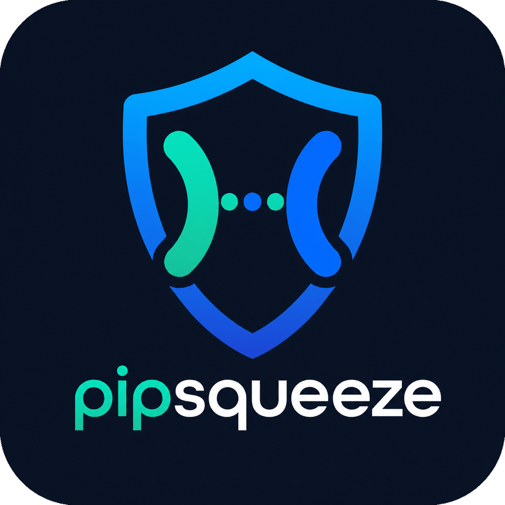

<p align="center">
  
</p>

<h1 align="center">PipSqueeze</h1>

<p align="center">
  Self-hosted WireGuard VPN dashboard for MikroTik routers — like Tailscale, but yours.
</p>

<p align="center">
  
  
  
  
  
</p>

---

## What is PipSqueeze?

PipSqueeze is a self-hosted WireGuard VPN management dashboard that talks directly to your MikroTik router via the RouterOS API. No manual SSH, no CLI commands — create clients, download configs, and monitor your VPN from any browser.

**It's like Tailscale, but entirely yours:**

### Client management
- Create WireGuard clients and get a `.conf` file + QR code instantly
- Manage peers: enable/disable, rename, clone, bulk actions, expiry dates
- Three access modes per client: **Internet Only / LAN Only / Full Access**
- Per-client bandwidth quota with auto-disable when exceeded
- Self-serve client portal — clients download their own config via a unique link (no login)
- One-time **provision URLs** — share a link, the visitor gets a fresh client created on first visit
- **Import** existing peers created outside PipSqueeze (manual or via another tool) into the dashboard

### Live monitoring
- 30-second polling thread records traffic deltas (survives MikroTik reboots), connect/disconnect events, ping latency, and online/offline status
- Live peer status with traffic sparklines, ping latency, and 7/30/90-day uptime %
- World map of client locations (Leaflet.js + OpenStreetMap, CartoDB Dark Matter tiles)
- Auto-geolocation from connection endpoint IP (HTTPS, no API key)
- Weekly usage digest with top users and uptime leaders

### Security
- **2FA** (TOTP) on every login, with failed-attempt rate limiting and IP lockout
- Multi-user admin accounts with **role-based access** (admin / viewer)
- **CSRF protection** on every state-changing route (Flask-WTF)
- Secure cookies (HttpOnly + Secure + SameSite=Lax) and configurable session timeout
- Notification credentials (SMTP password, Discord webhook, Telegram token) **encrypted at rest** via Fernet (AES-128-CBC + HMAC-SHA256)
- Optional IP whitelist gates the entire dashboard
- Full login audit trail: IP, username, success/failure, reason

### Notifications
- Discord, Email (SMTP), and Telegram channels — all optional, all togglable per event
- Per-event toggles for: connect, disconnect, expiry, expiry reminder (3 days before), new client, delete, regen, quota exceeded, login failure, IP lockout, provision-link used
- Weekly digest email with usage stats

### Integrations
- **REST API** (`/api/v1/*`) for external scripts and automation. SHA-256-hashed API keys with `read` / `write` scopes, sent via `Authorization: Bearer` or `X-API-Key`.
- **MikroTik firewall sync** — clients in "Internet Only" mode are automatically added to a `pipsqueeze-lan-block` address-list with one DROP rule, denying them LAN access at the router
- **PWA** — installable as a desktop / mobile app, with offline-friendly service worker
- **CSV export** of clients, **backup ZIP** with DB + notification settings JSON
- **Auto-cleanup** of never-connected clients after a configurable number of days

---

## Screenshots

### Login Page


### Dashboard


### WireGuard Peers


### QR Code Generation


---

## Architecture

```
        ┌──────────────────────────────┐
        │         User Browser         │
        └──────────────┬───────────────┘
                       │ HTTPS
                       ▼
        ┌──────────────────────────────┐
        │     Nginx (reverse proxy)    │
        └──────────────┬───────────────┘
                       ▼
        ┌──────────────────────────────┐
        │   Gunicorn + Flask (app.py)  │
        │  Routes / Auth / Monitor     │
        └───────┬──────────────┬───────┘
                │              │
                ▼              ▼
     ┌─────────────────┐  ┌───────────────────┐
     │  SQLite DB      │  │  MikroTik Router   │
     │ vpn_dashboard   │  │  RouterOS API      │
     │     .db         │  │  (mikrotik_api.py) │
     └─────────────────┘  └───────────────────┘
```

A background thread polls MikroTik every 30 seconds — recording traffic deltas, ping latency, uptime status, and connect/disconnect events.

---

## Prerequisites

Before you begin, make sure you have:

- A **MikroTik router** (running RouterOS 7.x) with a WireGuard interface already configured
- A **VPS or server** running Ubuntu 20.04 or later (2 GB RAM minimum recommended)
- A **domain name** with an A record pointing to your VPS IP
- **Python 3.10+** on the server (`python3 --version` to check)
- **nginx** — `apt install nginx`
- **Certbot** for free HTTPS — `apt install certbot python3-certbot-nginx`
- **WireGuard tools** on the server — `apt install wireguard-tools`

---

## Installation

### Step 1 — Clone the repository

```bash
git clone https://github.com/syedhashmi-bit/pipsqueeze.git /var/www/pipsqueeze
cd /var/www/pipsqueeze
```

### Step 2 — Create the virtual environment

```bash
python3 -m venv venv
source venv/bin/activate
pip install -r requirements.txt
```

### Step 3 — Configure your environment

```bash
cp .env.example .env
nano .env
```

Fill in every variable. The most critical ones to set before first boot:

| Variable | What to put here |
|----------|-----------------|
| `SECRET_KEY` | A long random string — run `python3 -c "import secrets; print(secrets.token_hex(32))"` |
| `APP_USERNAME` | Your admin login username |
| `APP_PASSWORD` | A strong admin password |
| `TOTP_SECRET` | Generate in Step 8 and come back |
| `SERVER_PUBLIC_KEY` | Public key of your WireGuard interface on MikroTik |
| `SERVER_IP` | Your VPS public IP or domain (written into every client `.conf` as the endpoint) |
| `SERVER_PORT` | WireGuard listen port on MikroTik (usually `51820`) |
| `CLIENT_DNS` | DNS pushed to VPN clients (e.g. `1.1.1.1` or your router IP) |
| `MT_HOST` | Your MikroTik router's LAN IP address |
| `MT_USERNAME` | MikroTik API user (create one in Step 4) |
| `MT_PASSWORD` | MikroTik API user password |
| `MT_WIREGUARD_INTERFACE` | Exact name of the WireGuard interface on MikroTik (e.g. `WireGuard1`) |

See the full [Configuration Reference](#configuration-reference) table for all options.

### Step 4 — Set up MikroTik

On your MikroTik router, do the following. You can use Winbox, WebFig, or the terminal.

**1. Create a WireGuard interface** (if you haven't already):

- Winbox → **WireGuard** → click `+`
- Give it a name (e.g. `WireGuard1`)
- Set the **Listen Port** to `51820`
- Click **OK** — RouterOS generates the key pair automatically
- Open the interface you just created and copy the **Public Key** — you'll need it for `SERVER_PUBLIC_KEY`

**2. Create an API user**:

- Winbox → **System → Users** → click the **Groups** tab → click `+`
- Name the group (e.g. `api-group`)
- Under **Policies**, check: `read`, `write`, `api`
- Click **OK**
- Now go to the **Users** tab → click `+`
- Set a username (e.g. `api`) and a strong password
- Set **Group** to the group you just created
- Click **OK**

**3. Enable the API service**:

- Winbox → **IP → Services**
- Find `api` in the list — make sure it is **enabled** and listening on port `8728`

**4. Note down**: interface name, MikroTik LAN IP, API username, API password.

### Step 5 — Create the systemd service

Create the file `/etc/systemd/system/pipsqueeze.service`:

```bash
nano /etc/systemd/system/pipsqueeze.service
```

Paste the following (adjust `User` if your VPS user is not `root`):

```ini
[Unit]
Description=PipSqueeze VPN Dashboard
After=network.target

[Service]
User=root
WorkingDirectory=/var/www/pipsqueeze
ExecStart=/var/www/pipsqueeze/venv/bin/gunicorn -w 1 -b 127.0.0.1:5000 app:app
Restart=always
RestartSec=5
Environment=PATH=/var/www/pipsqueeze/venv/bin

[Install]
WantedBy=multi-user.target
```

Enable and start the service:

```bash
systemctl daemon-reload
systemctl enable pipsqueeze
systemctl start pipsqueeze
systemctl status pipsqueeze
```

The app is now running on `127.0.0.1:5000`. nginx will proxy to it next.

### Step 6 — Set up nginx

Create a new site config:

```bash
nano /etc/nginx/sites-available/pipsqueeze
```

Paste the block below, replacing `YOUR_DOMAIN` with your actual domain:

```nginx
server {
    listen 80;
    server_name YOUR_DOMAIN;

    location / {
        proxy_pass         http://127.0.0.1:5000;
        proxy_set_header   Host              $host;
        proxy_set_header   X-Real-IP         $remote_addr;
        proxy_set_header   X-Forwarded-For   $proxy_add_x_forwarded_for;
        proxy_set_header   X-Forwarded-Proto $scheme;
        proxy_read_timeout 120s;
    }

    location /static/ {
        alias   /var/www/pipsqueeze/static/;
        expires 7d;
    }

    client_max_body_size 10M;
}
```

Enable the site and reload nginx:

```bash
ln -s /etc/nginx/sites-available/pipsqueeze /etc/nginx/sites-enabled/
nginx -t
systemctl reload nginx
```

### Step 7 — Point your domain and get HTTPS

1. In your DNS provider, add an **A record**: `YOUR_DOMAIN` → your VPS IP address
2. Wait a few minutes for DNS to propagate, then run Certbot:

```bash
certbot --nginx -d YOUR_DOMAIN
```

Certbot will automatically update your nginx config and configure auto-renewal. Your dashboard is now accessible at `https://YOUR_DOMAIN`.

Verify auto-renewal is scheduled:

```bash
systemctl status certbot.timer
```

### Step 8 — Set up two-factor authentication (2FA)

PipSqueeze requires TOTP 2FA on every login (same standard as Google Authenticator and Authy).

**Generate a TOTP secret:**

```bash
source /var/www/pipsqueeze/venv/bin/activate
python3 -c "import pyotp; print(pyotp.random_base32())"
```

Copy the output (it looks like `JBSWY3DPEHPK3PXP`) and add it to your `.env`:

```
TOTP_SECRET=JBSWY3DPEHPK3PXP
```

**Get a QR code to scan into your authenticator app:**

```bash
python3 -c "
import pyotp, os
from dotenv import load_dotenv
load_dotenv()
secret = os.getenv('TOTP_SECRET')
uri = pyotp.totp.TOTP(secret).provisioning_uri(name='admin', issuer_name='PipSqueeze')
print(uri)
"
```

Paste the `otpauth://` URI into any online QR generator and scan it with **Google Authenticator**, **Authy**, or **1Password**. Alternatively, enter the raw secret manually in your app.

Restart the service to pick up the new `.env` value:

```bash
systemctl restart pipsqueeze
```

### Step 9 — First login

Visit `https://YOUR_DOMAIN` in your browser.

- **Username**: the value you set for `APP_USERNAME`
- **Password**: the value you set for `APP_PASSWORD`
- **2FA code**: the current 6-digit code from your authenticator app

You're in. Create your first WireGuard client from the dashboard.

---

## Configuration Reference

All configuration lives in `.env`. Copy `.env.example` to get started.

### Required
| Variable | Description |
|----------|-------------|
| `SECRET_KEY` | Flask session encryption key. Generate with `python3 -c "import secrets; print(secrets.token_hex(32))"` |
| `APP_USERNAME` | Default admin login username (seeded into `admin_users` table on first boot) |
| `APP_PASSWORD` | Default admin login password |
| `TOTP_SECRET` | Base32 TOTP secret for 2FA (generate with `pyotp.random_base32()`) |
| `SERVER_PUBLIC_KEY` | WireGuard public key of your MikroTik interface — written into every client `.conf` |
| `SERVER_IP` | Your VPS public IP or domain — the `Endpoint` in client configs |
| `SERVER_PORT` | WireGuard UDP listen port on MikroTik (usually `51820`) |
| `CLIENT_DNS` | DNS server written into client configs (e.g. `1.1.1.1`) |
| `MT_HOST` | MikroTik router LAN IP address |
| `MT_USERNAME` | MikroTik API username |
| `MT_PASSWORD` | MikroTik API password |
| `MT_WIREGUARD_INTERFACE` | Exact WireGuard interface name on MikroTik (e.g. `WireGuard1`) |

### Optional — security
| Variable | Default | Description |
|----------|---------|-------------|
| `SECRET_VAULT_KEY` | derived from `SECRET_KEY` | Fernet key(s) for encrypting notification secrets at rest. Comma-separate multiple keys for rotation (first = primary, others = decrypt-only). Generate with `python3 -c "import vault; print(vault.generate_key())"` |
| `MAX_LOGIN_ATTEMPTS` | `5` | Failed logins before IP lockout |
| `LOCKOUT_MINUTES` | `15` | Lockout duration in minutes |
| `SESSION_TIMEOUT_MIN` | `30` | Inactivity timeout before auto-logout |
| `IP_WHITELIST` | *(allow all)* | Comma-separated IPs allowed to access the dashboard. Blank = no restriction |
| `COOKIE_INSECURE` | unset | Set to `1` only when running locally over plain HTTP (test harness, dev). In production leave unset so cookies are `Secure` |

### Optional — MikroTik & networking
| Variable | Default | Description |
|----------|---------|-------------|
| `MT_PORT` | `8728` | MikroTik API port (`8728` = plaintext, `8729` = TLS) |
| `LAN_SUBNET` | `192.168.88.0/24` | Your home LAN subnet — used by access-mode `lan` / `full` for the client `.conf` `AllowedIPs` |
| `MT_LOCATION_NAME` | unset | Display name for the MikroTik gateway pin on the map |
| `MT_LAT` | unset | Gateway pin latitude. Leave blank to omit the pin |
| `MT_LON` | unset | Gateway pin longitude. Leave blank to omit the pin |

### Optional — notifications & cleanup
| Variable | Default | Description |
|----------|---------|-------------|
| `WEEKLY_DIGEST_DAY` | `monday` | Day of the week to send the weekly digest email |
| `AUTO_CLEANUP_DAYS` | `0` (disabled) | Auto-delete clients with `last_seen IS NULL` whose `created_at` is older than N days. Runs at most once per UTC day from the monitor thread. |

---

## Updating

```bash
cd /var/www/pipsqueeze
git pull
source venv/bin/activate
pip install -r requirements.txt
systemctl restart pipsqueeze
```

DB schema migrations run automatically in `init_db()` on every boot — no manual step needed.

---

## REST API

PipSqueeze exposes a stateless API for external scripts and integrations under `/api/v1/`. Authenticate by sending the API key in either header form:

```
Authorization: Bearer pps_<your-key>
X-API-Key: pps_<your-key>
```

Generate keys at **🔑 API KEYS** in the topbar (admin only). Keys are SHA-256-hashed at rest and the plaintext is shown **once** on creation. Each key has a scope:

- `read` — list clients, list live peers
- `write` — read scope plus enable / disable

### Endpoints

| Method | Path | Scope | Description |
|--------|------|-------|-------------|
| `GET` | `/api/v1/clients` | read | Returns the full clients table as JSON |
| `GET` | `/api/v1/peers` | read | Live MikroTik peer list (status, traffic, handshake, endpoint IP) |
| `POST` | `/api/v1/clients/<name>/enable` | write | Enable a client on MikroTik + DB |
| `POST` | `/api/v1/clients/<name>/disable` | write | Disable a client on MikroTik + DB |

### Example

```bash
KEY="pps_..."
curl -s -H "Authorization: Bearer $KEY" \
  https://YOUR_DOMAIN/api/v1/clients | jq
```

---

## Testing

PipSqueeze ships with two test layers in `tests/`:

| Layer | Purpose | Browser? | Apt deps? |
|-------|---------|----------|-----------|
| `tests/test_http_smoke.py` | Verifies CSRF, cookie flags, vault encryption, ipapi.co geolocation, sw.js versioning, import route, API key scopes, cheatsheet, uptime clamping, auto-cleanup helper | no | no |
| `tests/test_ui_smoke.py` | Real Chromium walks login (TOTP), every protected page, the `?` cheatsheet shortcut, and the map regression | yes | yes |

```bash
source venv/bin/activate
pip install -r requirements-dev.txt

# HTTP suite — fast, no browser, no apt deps required
pytest tests/test_http_smoke.py -v

# UI suite — needs Chromium + system libs (one-time)
playwright install --with-deps chromium
pytest tests/test_ui_smoke.py -v

# Full run (~75s)
pytest tests/ -v
```

Both suites spawn an isolated test instance on port 5050 with a copy of the production DB and deterministic 2FA credentials — they never touch the live service or its database.

---

## Troubleshooting

**Service won't start**

```bash
journalctl -u pipsqueeze -n 50 --no-pager
```

Look for missing packages (`pip install -r requirements.txt`) or bad `.env` values (missing required keys, syntax errors).

---

**"Not enough permissions" from MikroTik**

Your API user's group policy must include `read`, `write`, and `api`. Check in Winbox → System → Users → Groups.

---

**2FA code rejected**

TOTP requires your server clock to be within ~30 seconds of real time.

```bash
timedatectl status
```

If the clock is off, sync it:

```bash
timedatectl set-ntp true
```

---

**Can't reach the dashboard after install**

Check each layer in order:

```bash
systemctl status pipsqueeze        # app running?
systemctl status nginx             # nginx running?
nginx -t                           # nginx config valid?
dig YOUR_DOMAIN                    # DNS propagated?
ufw allow 'Nginx Full'             # firewall open on 80/443?
```

---

**MikroTik API connection refused**

- Confirm the API service is enabled: Winbox → IP → Services → `api` should show **enabled**
- Confirm `MT_HOST` is reachable from your VPS: `ping <MT_HOST>`
- If MikroTik is behind NAT, ensure port `8728` is port-forwarded to the router

---

**How to view live logs**

```bash
journalctl -u pipsqueeze -f
```

---

## Tech Stack

| Layer | Technology |
|-------|-----------|
| Backend | Python 3.12, Flask, SQLite |
| Router API | RouterOS-api (MikroTik) |
| Frontend | Jinja2 server-rendered HTML, Chart.js sparklines, Leaflet.js + CartoDB Dark Matter tiles |
| Auth | pyotp (TOTP 2FA), Werkzeug scrypt password hashes, rate limiting, session timeout |
| Security | Flask-WTF (CSRF), `cryptography` Fernet/MultiFernet (at-rest encryption), Secure/HttpOnly/SameSite cookies, optional IP whitelist, full login audit |
| API | SHA-256-hashed keys, `Authorization: Bearer` / `X-API-Key`, scoped read/write under `/api/v1/` |
| Server | Gunicorn, Nginx, Ubuntu |
| Notifications | Discord Webhooks, SMTP Email, Telegram Bot API |
| PWA | manifest.json + service worker (versioned cache, static-only) |
| Tests | pytest, pytest-playwright (Chromium) |

---

## License

MIT — use it, modify it, self-host it.
